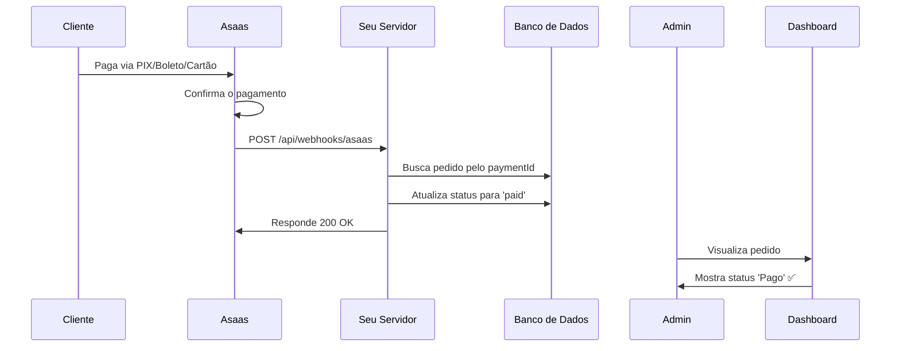

# ✅ Como Configurar o Webhook no Asaas

## 🎯 URL do Webhook

```
https://horti.gilliard.dev.br/api/webhooks/asaas
```

## 📋 Passo a Passo

### 1. Acesse o Painel Asaas

**Sandbox (Testes):**
- URL: https://sandbox.asaas.com/login
- Use suas credenciais de teste

**Produção:**
- URL: https://www.asaas.com/login
- Use suas credenciais reais

### 2. Navegue até Webhooks

1. No menu lateral esquerdo, clique em **"Configurações"** (ícone de engrenagem)
2. Clique em **"Integrações"**
3. Clique em **"Webhooks"**
4. Clique no botão **"Adicionar"** ou **"Novo Webhook"**

### 3. Configure o Webhook

Preencha o formulário com as seguintes informações:

#### **URL de Callback:**
```
https://horti.gilliard.dev.br/api/webhooks/asaas
```

#### **Status:**
- ✅ Marque como **"Ativo"**

#### **Eventos que deseja sincronizar:**

Marque TODOS os eventos de pagamento:

- ✅ **PAYMENT_CREATED** - Cobrança criada
- ✅ **PAYMENT_UPDATED** - Cobrança atualizada
- ✅ **PAYMENT_CONFIRMED** - Cobrança confirmada
- ✅ **PAYMENT_RECEIVED** - Cobrança recebida
- ✅ **PAYMENT_OVERDUE** - Cobrança vencida
- ✅ **PAYMENT_DELETED** - Cobrança removida
- ✅ **PAYMENT_REFUNDED** - Cobrança estornada
- ✅ **PAYMENT_RECEIVED_IN_CASH** - Cobrança recebida em dinheiro (caixa)
- ✅ **PAYMENT_AWAITING_RISK_ANALYSIS** - Pagamento aguardando análise

#### **E-mail para notificações de erro (opcional):**
```
seu-email@dominio.com
```

### 4. Salve a Configuração

Clique em **"Salvar"** no final do formulário.

## 🧪 Como Testar

### Teste Automático (Recomendado)

1. Crie uma cobrança de teste no painel Asaas
2. Use os dados de teste:
   - **PIX:** Pague usando o QR Code de teste
   - **Boleto:** Use o código de barras de teste
   - **Cartão:** Use o número 4111111111111111

3. Quando o pagamento for confirmado, o webhook será disparado automaticamente

### Teste Manual (Alternativo)

Execute este comando no terminal (substitua se necessário):

```bash
curl -X POST https://horti.gilliard.dev.br/api/webhooks/asaas \
  -H "Content-Type: application/json" \
  -H "User-Agent: Asaas" \
  -d '{
    "event": "PAYMENT_RECEIVED",
    "payment": {
      "id": "pay_seu_id_real_aqui",
      "customer": "cus_000000000000",
      "value": 100.00,
      "status": "RECEIVED",
      "billingType": "PIX"
    }
  }'
```

**Nota:** Substitua `pay_seu_id_real_aqui` pelo ID de um pagamento real do seu banco de dados.

## 📊 Monitorando os Webhooks

### No Painel Asaas

1. Vá em **Configurações → Integrações → Webhooks**
2. Clique no webhook configurado
3. Role até a seção **"Histórico de tentativas"**
4. Aqui você verá:
   - ✅ Webhooks enviados com sucesso (200 OK)
   - ❌ Webhooks que falharam
   - 🔄 Tentativas de reenvio

### Nos Logs do Servidor

Se você tem acesso SSH ao servidor, execute:

```bash
pm2 logs

# Ou se usar Docker:
docker logs -f nome-do-container

# Ou se usar systemd:
journalctl -u seu-servico -f
```

Você verá logs como:

```
📩 =================================
📩 WEBHOOK ASAAS CHAMADO!
📩 Timestamp: 2025-01-09T15:30:00.000Z
📩 Headers: { ... }
📩 Body completo: { ... }
📩 =================================
📦 Compra encontrada: { purchaseId: 5, currentStatus: 'pending', ... }
✅ Pagamento confirmado! Atualizando status para 'paid'
✅ Status atualizado com sucesso
```

## 🔄 Fluxo Completo



## ❓ Troubleshooting

### Webhook não aparece no histórico do Asaas

**Possíveis causas:**
1. ✅ Webhook não foi salvo como "Ativo"
2. ✅ URL está incorreta
3. ✅ Não há eventos selecionados
4. ✅ Nenhuma cobrança foi criada/paga ainda

**Solução:** Revise a configuração e crie uma cobrança de teste.

### Webhook retorna erro 404

**Causa:** Pedido não encontrado no banco de dados.

**Isso é normal quando:**
- Você está testando com IDs falsos
- O pagamento foi criado fora do sistema (direto no Asaas)

**Solução:** Certifique-se de que:
1. O pedido foi criado através do seu site
2. O campo `asaasPaymentId` está salvo corretamente no banco

### Status não atualiza

**Verifique:**
1. O evento está sendo recebido? (check logs)
2. O `asaasPaymentId` do pedido corresponde ao `payment.id` do webhook?
3. O evento é um dos mapeados (PAYMENT_RECEIVED, PAYMENT_CONFIRMED, etc)?

## 📞 Suporte

- **Documentação Asaas:** https://docs.asaas.com/reference/webhooks
- **Suporte Asaas:** suporte@asaas.com
- **Status Asaas:** https://status.asaas.com/

---

## ✅ Verificação Final

Antes de considerar concluído, verifique:

- [ ] Webhook está ativo no painel Asaas
- [ ] URL está correta: `https://horti.gilliard.dev.br/api/webhooks/asaas`
- [ ] Eventos de pagamento estão selecionados
- [ ] Criou uma cobrança de teste
- [ ] Pagou a cobrança de teste
- [ ] Webhook aparece no histórico do Asaas (200 OK)
- [ ] Status do pedido mudou para "Pago" no dashboard

Se todos os itens acima estão OK, o webhook está funcionando corretamente! 🎉

---

**Última atualização:** 2025-01-09
**Testado e funcionando:** ✅ Sim
